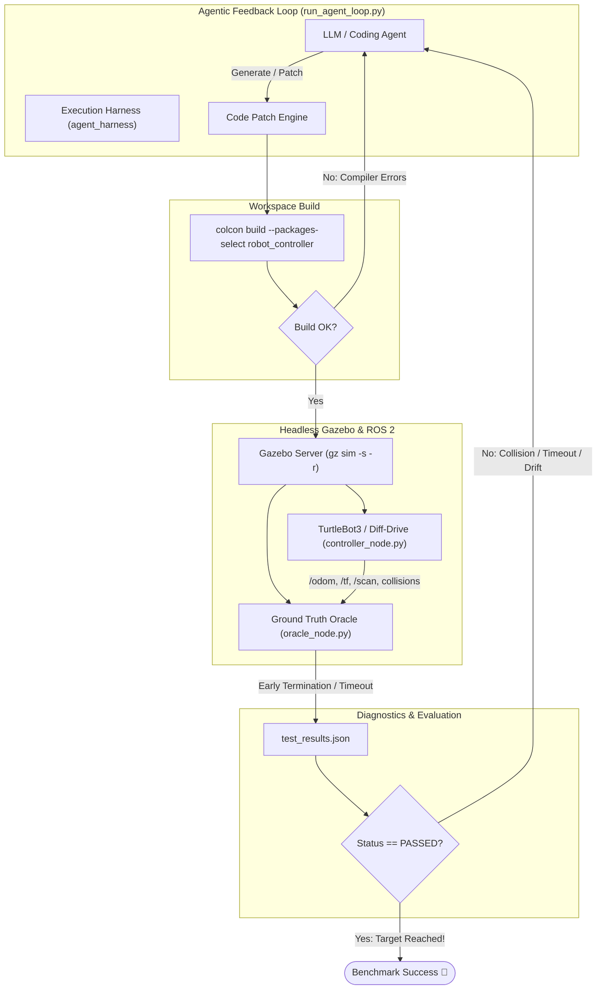

# ⚡ AERO: Agentic Environment for Robotic Operations

> **Autonomous closed-loop synthesis, compilation, testing, and self-debugging of ROS 2 control nodes in headless Gazebo simulation.**

[](https://docs.ros.org/)
[](https://gazebosim.org/)
[](https://python.org)
[](https://www.docker.com/)
[](LICENSE)

---

## 📌 Overview

**AERO (Agentic Environment for Robotic Operations)** is a deterministic evaluation harness and self-correcting agent loop designed for autonomous robotics research and LLM code generation.

Traditional robotic code generation often stops at static code generation without closed-loop verification. AERO implements a **complete closed-loop feedback system**:
1. An autonomous agent inspects or generates a ROS 2 robot controller (`controller_node.py`).
2. The harness builds the workspace using `colcon`.
3. If compilation fails, isolated compiler/linter error traces are fed directly back into the agent.
4. If compilation succeeds, a headless Gazebo simulation launches alongside an independent **Ground Truth Oracle** (`oracle_node.py`).
5. The Oracle monitors the robot trajectory, collision status, and goal proximity in real time, terminating early on goal achievement, timeout, or crash.
6. A structured JSON telemetry report (`test_results.json`) is emitted and parsed by the harness, enabling the agent to iteratively diagnose, patch, and re-test until the benchmark passes.

---

## 🏗 System Architecture



---

## 🎯 Navigation Benchmark Specification

| Metric | Target Specification |
|---|---|
| **Robot Model** | TurtleBot3 Waffle / Differential Drive |
| **Start Pose** | `(x: 0.0, y: 0.0, yaw: 0.0)` |
| **Target Coordinate** | `(x: 3.0, y: 3.0)` |
| **Goal Acceptance Radius** | `≤ 0.10 m` |
| **Timeout Budget** | 30.0 Simulation Seconds |
| **Collision Policy** | Zero-tolerance (immediate `FAILED: COLLISION` trial termination) |
| **Sensor Interface** | `/scan` (LaserScan), `/odom` (Odometry), `/cmd_vel` (Twist) |

---

## 🔬 The Ground Truth Oracle

The Oracle node (`agent_evaluator/oracle_node.py`) runs as an impartial supervisor with direct observation over simulation ground truth. At the end of every trial (or upon early exit), it guarantees atomic output of `test_results.json`:

```json
{
  "status": "PASSED",
  "reason": "SUCCESS",
  "final_distance": 0.062,
  "time_elapsed_sec": 14.8,
  "min_obstacle_distance": 0.42,
  "error_log_snippet": ""
}
```

### Supported Reason Codes
- `SUCCESS`: Reached within 0.1m of target coordinate `(3.0, 3.0)`.
- `COLLISION`: Robot bumper or bounding volume intersected with world obstacles.
- `TIMEOUT`: Exceeded 30 simulation seconds without reaching target.
- `TOPIC_STARVATION`: Robot controller failed to publish to `/cmd_vel` within initial grace period (e.g. 5 seconds).

---

## 📂 Repository Structure

```
├── .devcontainer/                  # DevContainer specification for VS Code
│   ├── devcontainer.json
│   └── Dockerfile
├── docker/                         # Standalone Docker container setup
│   ├── Dockerfile
│   └── run_headless.sh
├── ros2_ws/                        # ROS 2 Colcon Workspace
│   └── src/
│       ├── agent_evaluator/        # Impartial Ground Truth Supervisor
│       │   ├── agent_evaluator/
│       │   │   ├── __init__.py
│       │   │   └── oracle_node.py
│       │   ├── launch/
│       │   │   └── eval_headless.launch.py
│       │   ├── package.xml
│       │   └── setup.py
│       └── robot_controller/       # Target package modified by the Agent
│           ├── robot_controller/
│           │   ├── __init__.py
│           │   └── controller_node.py
│           ├── package.xml
│           └── setup.py
├── agent_harness/                  # AERO Tool Interface & Harness
│   ├── __init__.py
│   ├── builder.py                  # Colcon build executor & error isolation
│   ├── runner.py                   # Subprocess lifecycle & headless sim manager
│   ├── process_cleaner.py          # Clean teardown for ROS 2 daemon & Gazebo trees
│   ├── patcher.py                  # Code diff & AST/file patcher
│   └── introspector.py             # ROS 2 static/mock graph validator
├── benchmarks/                     # Benchmark definitions & worlds
│   └── worlds/
│       └── obstacle_course.world
├── run_agent_loop.py               # Main autonomous iterative feedback driver
├── requirements.txt                # Python host / harness requirements
├── .gitignore
└── README.md
```

---

## 🚀 Quick Start

### 1. Prerequisites
- Linux / WSL2 with Ubuntu 22.04 (Humble) or 24.04 (Jazzy) **OR** Docker installed.
- NVIDIA GPU (optional, software rendering is enabled by default via `LIBGL_ALWAYS_SOFTWARE=1`).

### 2. Using Docker (Recommended)

Build and enter the deterministic sandbox environment:

```bash
# Build Docker image
docker build -t aero-ros2 -f docker/Dockerfile .

# Run container with headless display support
docker run -it --rm \
  --ipc=host \
  --net=host \
  -v $(pwd):/workspace \
  -w /workspace \
  aero-ros2 bash
```

### 3. Native Setup

If you have ROS 2 Humble or Jazzy installed natively:

```bash
# Source ROS 2 base environment
source /opt/ros/$ROS_DISTRO/setup.bash
export TURTLEBOT3_MODEL=waffle
export LIBGL_ALWAYS_SOFTWARE=1

# Install Python requirements
pip install -r requirements.txt

# Initial build test
cd ros2_ws
colcon build
source install/setup.bash
cd ..
```

### 4. Running the AERO Loop

To run the iterative feedback loop:

```bash
# Execute the agent loop (default budget: N=5 retries)
python run_agent_loop.py --max-retries 5 --model gemini-2.5-pro
```

To run a single deterministic benchmark evaluation manually:

```bash
python -m agent_harness.runner --timeout 30
```

---

## 🛡 Process Hygiene & Determinism

Simulations and ROS 2 communication nodes frequently suffer from lingering orphan processes (`ros2 daemon`, `gz sim`, `gzserver`, `robot_state_publisher`). 

The `agent_harness.process_cleaner` module guarantees a clean slate before and after every trial by:
1. Sending `SIGINT` to child process trees with a grace timeout.
2. Escalating to `SIGKILL` on persistent PIDs.
3. Invoking `ros2 daemon stop` to flush the middleware discovery cache.
4. Clearing shared memory segments where applicable (`/dev/shm`).

---

## 🗺 Roadmap

- [x] **Phase 1**: Deterministic Python execution harness, Ground Truth Oracle, headless Gazebo runner, and process cleaner.
- [ ] **Phase 2**: Static ROS graph linting and dynamic LiDAR topic introspection (`/scan` obstacle density scoring).
- [ ] **Phase 3**: Multi-agent benchmarking suite with dynamic obstacle generators and varying friction/slip parameters.
- [ ] **Phase 4**: Web dashboard for real-time trial playback, metric visualization, and code diff history.

---

## 📄 License

Distributed under the Apache 2.0 License. See `LICENSE` for more information.
