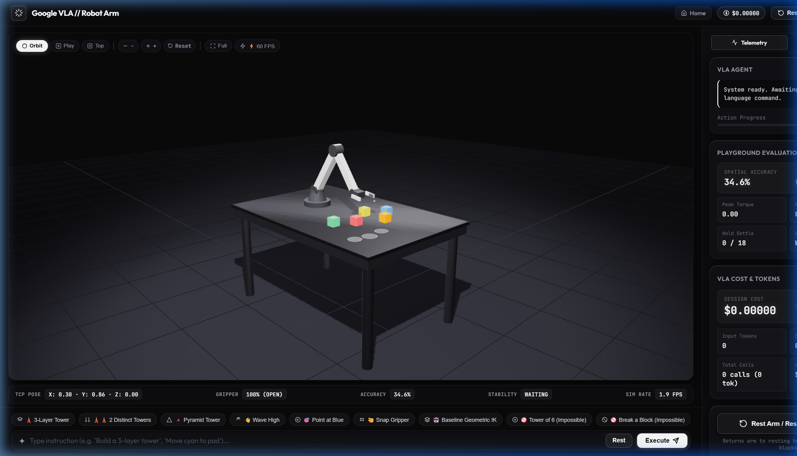
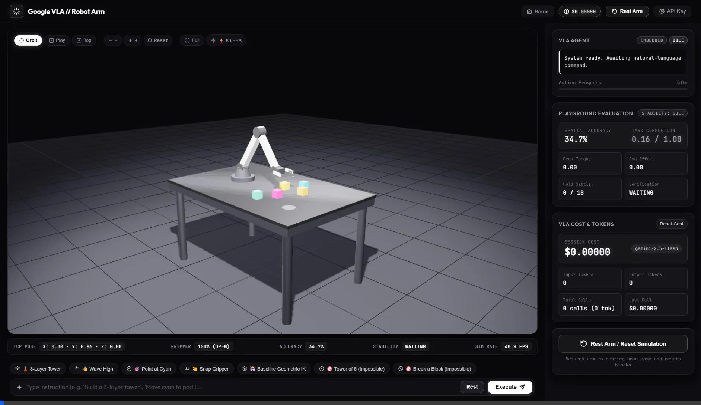
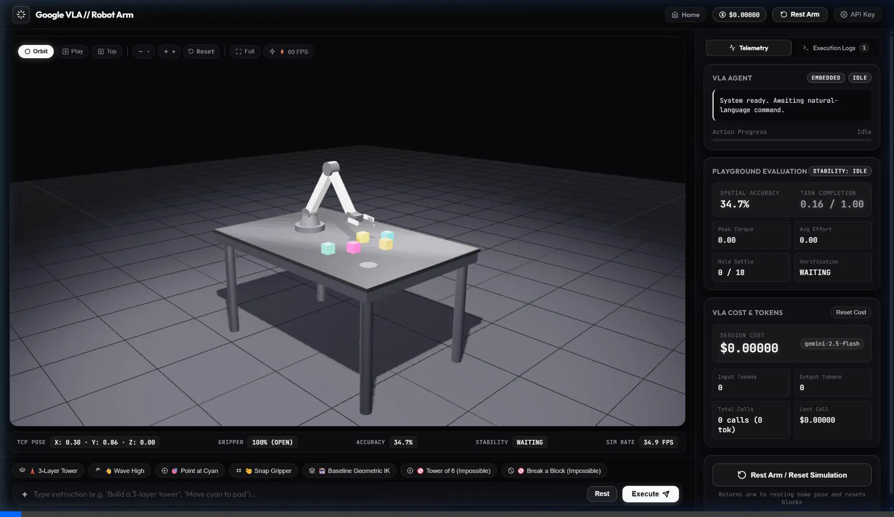
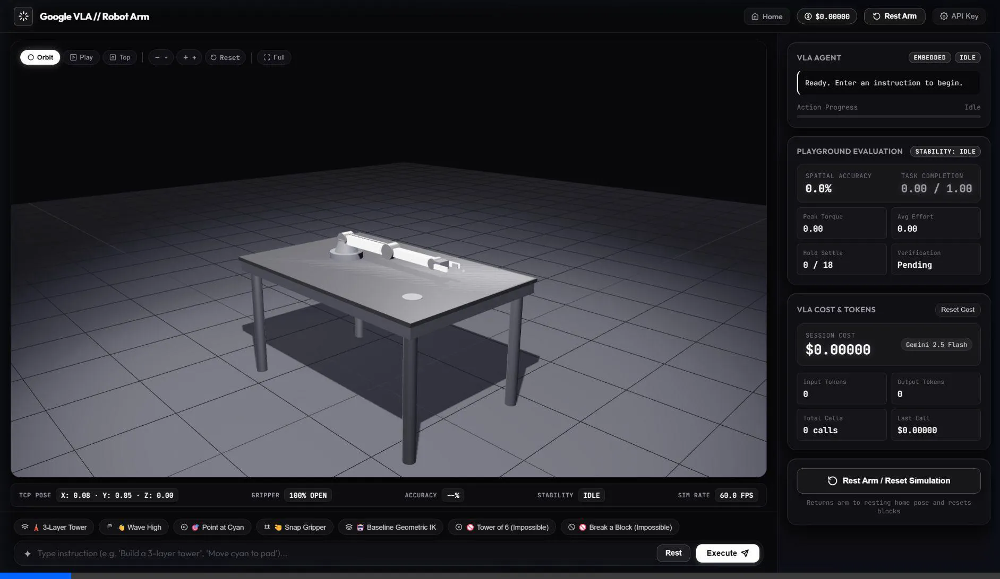
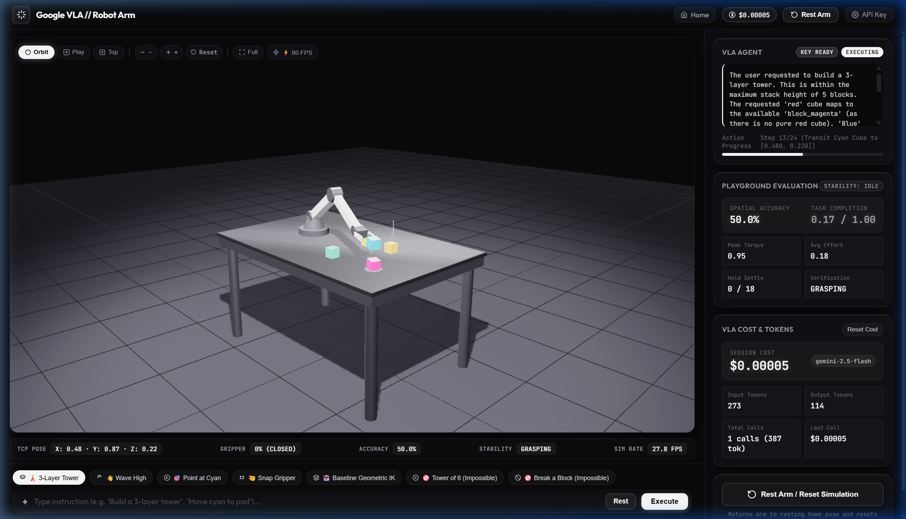
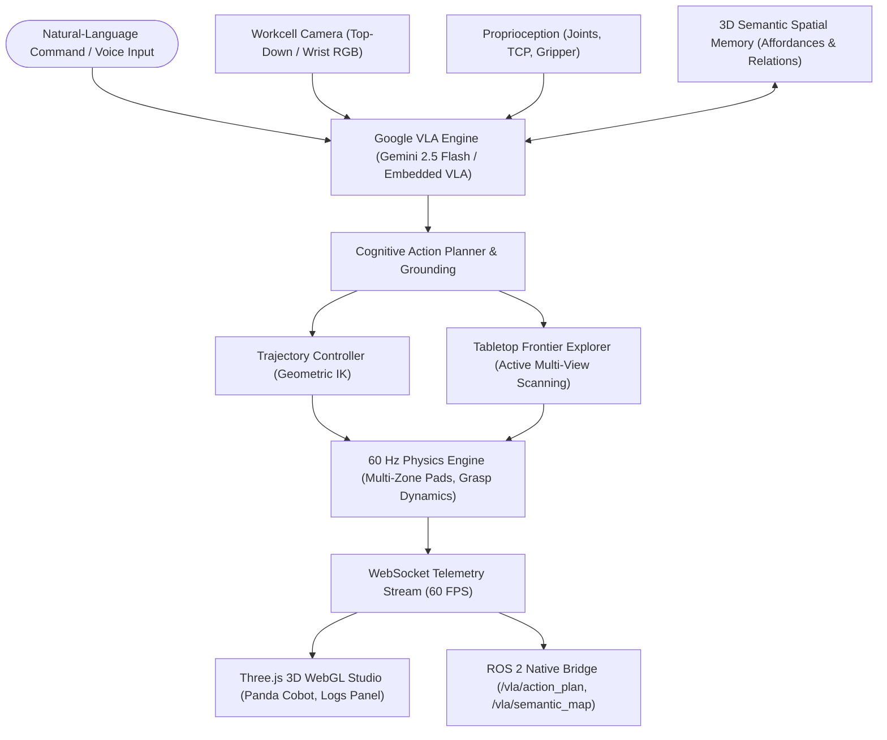
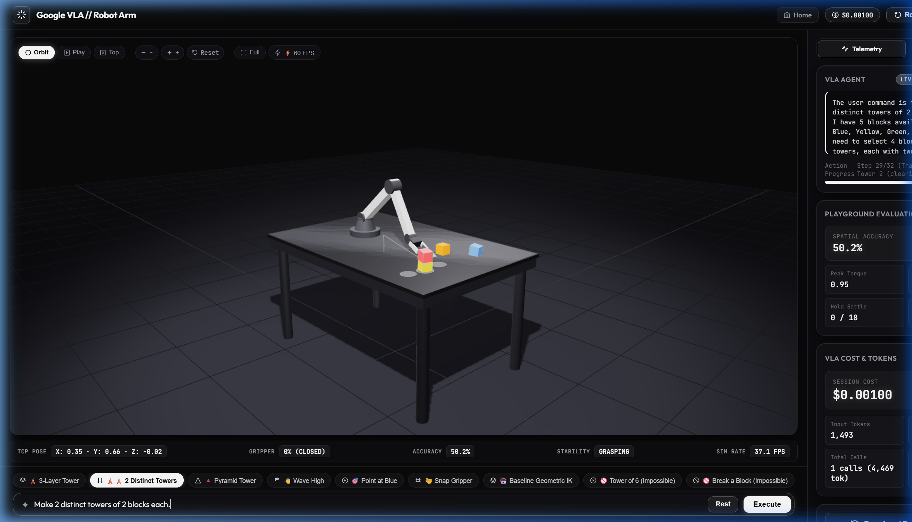
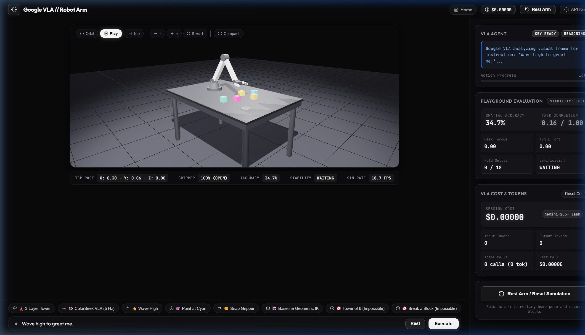

# 🤖 Aero: Google VLA Robot Arm Autonomous Manipulation Studio

<div align="center">

[](LICENSE)
[](https://python.org)
[](https://ros.org)
[](https://aistudio.google.com/)
[](https://threejs.org/)
[](https://rapier.rs/)
[](SECURITY.md)

**An end-to-end cognitive robotic manipulation platform combining Google Vision-Language-Action (VLA) multimodal reasoning, 3D tabletop spatial semantic mapping, frontier exploration, 60 FPS physics-aligned kinematics, multi-zone structural assembly, and an interactive Three.js WebGL studio.**

[🚀 Quick Start](#-quick-start) • [✨ Key Features](#-key-features) • [🎥 Demos & Visual Showcase](#-demos--visual-showcase) • [🗼 Multi-Tower & Pyramid](#-multi-zone--pyramid-assembly) • [💬 Natural Language Commands](#-example-natural-language-commands) • [🌐 ROS 2](#-ros-2-ecosystem-integration)

---

### 🌟 Multi-Zone Studio Overview

*High-resolution 3D WebGL Studio featuring articulated 5-DOF Franka-style cobot, dynamic color-calibrated cubes, and multi-zone landing pads (Pad A North, Center, Pad B South).*

</div>

---

## 🎥 Demos & Visual Showcase

### Fluid 60 FPS Kinematics & Live Execution Logs

<div align="center">

| ⚡ Smooth 60 FPS Kinematics | 📋 Real-Time Execution Logs |
| :---: | :---: |
|  |  |
| *Jitter-free joint angle slerp interpolation with zero-impulse drop* | *Telemetry log panel detailing what is happening and how* |

</div>

<div align="center">

| 🎯 Interactive Challenge Chips | 🗼 Multi-Layer Tower Assembly |
| :---: | :---: |
|  |  |
| *Persistent command bar with pre-configured verified actions* | *18-tick physical stability hold verification to avoid toppling* |

</div>

---

## 🌟 Architecture & System Pipeline

Aero translates high-level natural language intent into verified robotic manipulation primitives through a real-time multimodal loop:


```mermaid
graph TD
    User(["Natural-Language Command / Voice Input"]) --> Brain["Google VLA Engine (Gemini 2.5 Flash / Embedded VLA)"]
    Camera["Workcell Camera (Top-Down / Wrist RGB)"] --> Brain
    State["Proprioception (Joints, TCP, Gripper)"] --> Brain
    Semantic["3D Semantic Spatial Memory (Affordances & Relations)"] <--> Brain

    Brain --> Decomposer["Cognitive Action Planner & Grounding"]
    Decomposer --> TrajectoryCtrl["Trajectory Controller (Geometric IK)"]
    Decomposer --> Explorer["Tabletop Frontier Explorer (Active Multi-View Scanning)"]

    TrajectoryCtrl --> Sim["60 Hz Physics Engine (Multi-Zone Pads, Grasp Dynamics)"]
    Explorer --> Sim

    Sim --> Telemetry["WebSocket Telemetry Stream (60 FPS)"]
    Telemetry --> ThreeJS["Three.js 3D WebGL Studio (Panda Cobot, Logs Panel)"]
    Telemetry --> ROS2["ROS 2 Native Bridge (/vla/action_plan, /vla/semantic_map)"]
```

---

## 🗼 Multi-Zone & Pyramid Assembly

Aero extends beyond conventional single-column stacking to support multi-zone topological assemblies:


*Robot arm assembling 2 distinct towers across North (Pad A) and South (Pad B) landing zones with collision clearance clamping.*

### 1. Dual Distinct Towers (`STACK_DUAL_TOWERS`)
- **Twin Landing Zones**: Designated `STACK_ORIGIN_A` $(0.46, 0.72, 0.10)$ and `STACK_ORIGIN_B` $(0.46, 0.72, 0.32)$, spaced 22 cm apart to guarantee arm and finger clearance.
- **Cognitive Block Partitioning**: Splits available cubes into distinct subsets (e.g., Tower 1: Red & Blue; Tower 2: Yellow & Orange).
- **Collision-Free Transit Clamping**: Before moving to assemble Tower B, the arm dynamically clamps transit hover altitude ($y \ge \text{Tower A Top} + 0.10\text{ m}$) so it never strikes Tower A.
- **Physical Feasibility Check**: Prompts requesting $> 5$ cubes across towers are automatically caught and safely rejected.

### 2. Multi-Contact Pyramid Assembly (`BUILD_PYRAMID`)
- **3-Block Stepped 2D Pyramid**: Two base cubes are placed side-by-side touching flush along the Z-axis, with an apex block placed directly centered across the seam at Layer 1.
- **5-Block 3D Square Pyramid**: Four base cubes in a $2 \times 2$ grid with the fifth apex cube seated on top.
- **Zero-Impulse Contact Dwell**: Extra holding dwell ($+10$ ticks) during soft gripper release ensures base blocks remain stationary without frictional displacement.

---

## ✨ Key Features

### 1. 🧠 Google VLA (Vision-Language-Action)
- **Multimodal Visual Grounding**: Ingests $128 \times 128$ orthographic RGB frames, joint states, and 3D bounding coordinates.
- **Cognitive Decomposition**: Employs Google Gemini (`gemini-2.5-flash`, `gemini-2.0-flash`, `gemini-1.5-pro`) to reason about physical affordances and synthesize structured JSON waypoint sequences.
- **Offline Embedded VLA Runtime**: Features a deterministic, metric-locked policy executing with **zero external API keys or cloud dependencies** out of the box.
- **Live Cost & Token Metering**: Real-time header telemetry monitoring prompt tokens, visual image tokens ($258$ per frame), completion tokens, and dollar expenditures ($).

### 2. 📋 Real-Time Execution Logs Panel
- **Dedicated Telemetry Panel**: Live chronological feed explaining **what is happening** and **how** (e.g. *Waypoint 14/32: Soft descent to placement slot Y=0.802m · Closed jaws (100%) · Dwell: 25 ticks*).
- **Categorized Event Badges**: Color-coded badges for `IK MOTION`, `GRIP`, `RELEASE`, `EXPLORE`, and `VLA COGNITION`.

### 3. 🤖 Expressive Communicative Gestures

- **PlayScript Motion Primitives**: Communicative interactions including high wave greeting (`wave_high`), agreement nods (`nod`), gripper celebrations (`snap_gripper`), victory poses (`celebrate`), and dynamic pointing (`point_block`).

### 4. 🔬 Tabletop Frontier Exploration & 3D Spatial SLAM
- **Voxel Occupancy Mapping**: Sweeps camera trajectories across Northwest, Northeast, Southwest, and Southeast quadrants to construct 3D spatial occupancy.
- **Relational Affordance Graphs**: Continuously classifies blocks into `ON_TABLE`, `IN_GRIPPER`, and layer tiers with center-of-mass stability indices.

### 5. ⚡ 60 FPS Physics & Jitter-Free Kinematics
- **5-DOF Geometric IK & FK**: Solves analytical joint angles with singular boundary clamping.
- **Kinematic Slerp Smoothing**: Smooth joint angle and block orientation interpolation across 60 Hz animation frames eliminates laptop frame judder.
- **Laptop Performance Mode**: Dynamic toggle between Smooth mode (DPR 1.2, optimized shadows) and High-Fidelity mode (DPR 1.75, PCF soft shadows).

---

## 🔒 Security & Privacy

> [!IMPORTANT]
> **Zero Credential Leakage Guarantee**: Your Google Gemini API key is **never committed to Git or pushed to GitHub**.

1. **Local Storage**: When configured through the web dashboard, the key is saved exclusively in your browser's private `localStorage`.
2. **Repository Protection**: `.gitignore` strictly blocks all `.env`, `.env.*`, `*.key`, `secrets.json`, and credentials files.
3. **Telemetry Scrubbing**: Real-time WebSocket broadcasts and server log outputs scrub credentials.

---

## 🏁 Quick Start

### 1. Installation

```bash
# Clone the repository
git clone https://github.com/incheif/Aero.git
cd Aero

# Create and activate virtual environment
python -m venv .venv

# Windows (PowerShell):
.venv\Scripts\Activate.ps1

# Linux / macOS:
source .venv/bin/activate

# Install dependencies
pip install -r requirements.txt
```

### 2. Configure Environment (Optional)

```powershell
cp .env.example .env
```
*(By default, the offline Embedded VLA operates without any API key. If you wish to use live Google Gemini cloud reasoning, add your API key to `.env` or enter it directly in the dashboard UI).*

### 3. Launch the Studio

```powershell
python run_dashboard.py
```

The server boots and launches **`http://127.0.0.1:8000`** in your browser automatically.

---

## 💬 Example Natural-Language Commands

| Category | Example Instruction | Action Performed |
| :--- | :--- | :--- |
| **Multi-Zone Stacking** | `"Make 2 distinct towers of 2 blocks each."` | Builds Tower 1 on Pad A and Tower 2 on Pad B with elevated clearance |
| **Pyramid Geometry** | `"Build a pyramid tower."` | Assembles a 3-block stepped pyramid with apex bridging |
| **Full 3D Pyramid** | `"Build a 5-block square pyramid."` | Assembles 4 cubes in a $2 \times 2$ base with a centered apex cube |
| **Multi-Layer Tower** | `"Make a 3-layer tower of red, blue and yellow."` | Stacks 3 layers in exact color order with zero-impulse drop |
| **Apex Stacking** | `"Build a 5-layer tower with all 5 blocks."` | Full workcell utilization (5 vertical layers) |
| **Visual Servoing** | `"Run ColorSeek visual servoing."` | 5 Hz RGB pixel tracker closed-loop servoing |
| **Expressive Gesture**| `"Wave high to greet me."` | 3-cycle expressive waving motion |
| **Dynamic Pointing** | `"Point at the blue cube."` | Aims TCP end-effector directly at target block coordinates |
| **Active SLAM** | `"Explore the workspace and scan table quadrants."` | 4-quadrant trajectory survey updating 3D semantic memory |
| **Feasibility Reject** | `"Build a tower of 6 blocks."` | Automatically rejects impossible request (only 5 cubes available) |

---

## 🔬 Benchmark Telemetry & Evaluation

Aero adopts the rigorous benchmarking standards from **VSArena**:
1. **18-Tick Physical Stability Hold**: After gripper release, the stack must settle and remain stationary for at least 18 consecutive physics ticks (0.30 seconds) before being verified as completed.
2. **Spatial Accuracy Metric**: Evaluates $0.7 \times \text{Position Precision} + 0.3 \times \text{Upright Orientation Alignment}$ against target slots.
3. **Kinematic Effort & Torque Telemetry**: Continuous tracking of $\sum |\Delta q| \times \text{Gain}$ with peak and average effort telemetry.

---

## 🌐 ROS 2 Ecosystem Integration

A full ROS 2 package (`vla_robot_arm`) is included under `ros2_ws/`:

| Topic Name | Type | Description |
| :--- | :--- | :--- |
| `/vla/natural_language_command` | `std_msgs/String` | High-level natural language instructions |
| `/vla/cognitive_thought` | `std_msgs/String` | Live reasoning trace from Google VLA |
| `/vla/action_plan` | `std_msgs/String` | Synthesized waypoints and robotic action primitives |
| `/vla/semantic_map` | `std_msgs/String` | 3D Tabletop Semantic Spatial Affordance memory |
| `/vla/frontier_status` | `std_msgs/String` | Tabletop quadrant exploration metrics |

```bash
cd ros2_ws
colcon build --packages-select vla_robot_arm
source install/setup.bash
ros2 launch vla_robot_arm vla_robot_arm.launch.py
```

---

## 📂 Repository Structure

```
Aero/
├── .env.example            # Environment configuration template
├── .gitignore              # Git ignore rules for secrets and build artifacts
├── CODE_OF_CONDUCT.md      # Contributor Covenant Code of Conduct
├── CONTRIBUTING.md         # Developer contribution guidelines
├── LICENSE                 # MIT License (2026 Dhruv Gupta)
├── README.md               # Main project documentation with dynamic media
├── SECURITY.md             # Security policy and vulnerability disclosure
├── requirements.txt        # Python package dependencies
├── run_dashboard.py        # One-click dashboard entrypoint
├── docs/
│   └── assets/             # WebP demo animations and high-res UI screenshots
│       ├── hero_studio_multizone.png
│       ├── dual_towers_execution.png
│       ├── execution_logs_telemetry.png
│       ├── tower_assembly_60fps.png
│       ├── gesture_waving.png
│       ├── demo_smooth_60fps.webp
│       ├── demo_logs_panel.webp
│       └── demo_chips_interaction.webp
├── dashboard/              # FastAPI server, WebSockets, Three.js 3D WebGL UI
│   ├── server.py           # Backend loop, execution logs, WebSocket broadcast
│   └── static/             # HTML, CSS design system, Three.js renderer
├── simulation/             # Physics engine, kinematics (IK/FK), camera models
└── vla/                    # Google VLA agent, cost tracker, spatial mapper, interpreter
```

---

## 📄 License & Community Standards

- **License**: Distributed under the [MIT License](LICENSE). Copyright (c) 2026 Dhruv Gupta.
- **Code of Conduct**: Please review [CODE_OF_CONDUCT.md](CODE_OF_CONDUCT.md).
- **Contributing**: Check out [CONTRIBUTING.md](CONTRIBUTING.md) to get started with contributing.
- **Security**: Review our [SECURITY.md](SECURITY.md) for vulnerability handling and API key guidelines.
