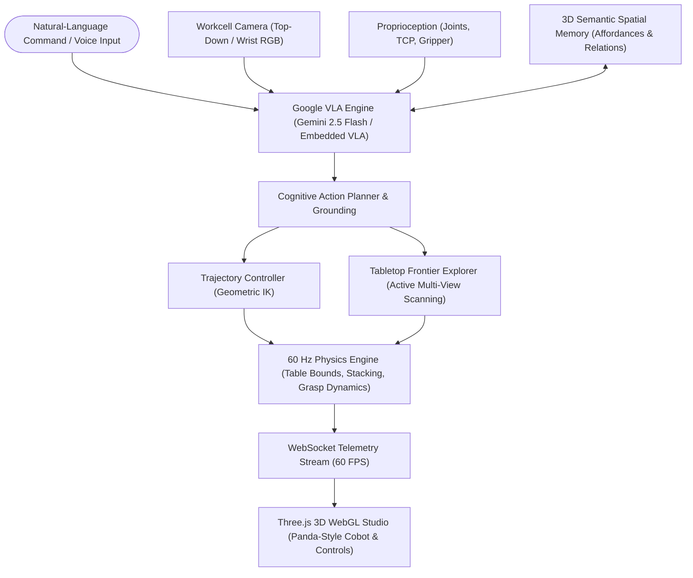

# 🤖 Aero: Google VLA Robot Arm Autonomous Manipulation Studio

[](LICENSE)
[](https://python.org)
[](https://ros.org)
[](https://aistudio.google.com/)
[](SECURITY.md)
[](CODE_OF_CONDUCT.md)

An end-to-end autonomous robotic manipulation platform combining **Google Vision-Language-Action (VLA)** multimodal reasoning, **3D Tabletop Semantic Spatial Mapping**, **Frontier Exploration**, **Rapier3D physics-aligned kinematics**, and an interactive **Three.js WebGL studio**.

---

## 🌟 Architecture & System Design

This platform translates the cognitive robotics paradigm (natural language + multimodal VLM + ROS 2 + SLAM + Frontier Exploration) into a high-precision **Articulated Robot Arm Manipulation Work-Cell**:


```mermaid
graph TD
    User(["Natural-Language Command / Voice Input"]) --> Brain["Google VLA Engine (Gemini 2.5 Flash / Embedded VLA)"]
    Camera["Workcell Camera (Top-Down / Wrist RGB)"] --> Brain
    State["Proprioception (Joints, TCP, Gripper)"] --> Brain
    Semantic["3D Semantic Spatial Memory (Affordances & Relations)"] <--> Brain

    Brain --> Decomposer["Cognitive Action Planner & Grounding"]
    Decomposer --> MotionCtrl["Trajectory Controller (Geometric IK)"]
    Decomposer --> Explorer["Tabletop Frontier Explorer (Active Multi-View Scanning)"]

    MotionCtrl --> Sim["60 Hz Physics Engine (Table Bounds, Stacking, Grasp Dynamics)"]
    Explorer --> Sim

    Sim --> Snapshots["WebSocket Telemetry Stream (60 FPS)"]
    Snapshots --> ThreeJS["Three.js 3D WebGL Studio (Panda-Style Cobot & Controls)"]
```

---

## 🚀 Key Modules & Capabilities

### 1. Google VLA (Vision-Language-Action)
- **Multimodal Visual Grounding**: Ingests real-time $128 \times 128$ orthographic RGB frames alongside user natural-language commands and 3D spatial memory.
- **Cognitive Decomposition**: Leverages Google Gemini (`gemini-2.5-flash`, `gemini-2.0-flash`, `gemini-1.5-pro`) to reason over spatial affordances, identify candidate pick targets, and synthesize discrete multi-stage manipulation plans.
- **Embedded VLA Runtime**: Features an offline closed-loop metric-locked policy executing with **zero external API key dependencies** for standalone local operation.
- **Live Cost & Token Metering**:
  - Live cost monitor in header (`💰 $0.00000`).
  - Tracks Prompt Tokens (text prompt + 258 visual tokens per image frame).
  - Tracks Completion Tokens (cognitive reasoning chain + action plan JSON).
  - Calculates real-time financial expenditure in USD ($) based on Google Gemini API rates.
  - Interactive history log of recent inferences with one-click counter reset.

### 2. 3D Semantic Spatial Mapping
- **Spatial Affordance SLAM**: Tracks tabletop entities (`cyan_cube`, `orange_cube`, `magenta_cube`, `yellow_cube`, `emerald_cube`, `target_pad`, `tcp_gripper`).
- **Dynamic State Tracking**: Automatically classifies objects into `ON_TABLE`, `IN_GRIPPER`, and stacked layers `STACKED_L0 (Base)` through `STACKED_L4 (Apex)`.
- **Topological Affordances**: Computes grasp clearances, center-of-mass stability indices, and dynamic relational graphs (e.g. `orange is stacked on top of cyan`).

### 3. Tabletop Frontier Exploration
- **Active Visual Scanning**: Sweeps trajectories across workspace quadrants (Northwest, Northeast, Southwest, Southeast) to resolve visual occlusions.
- **Safe Hover Transit**: Enforces safe altitude transit ($y = 0.855\text{ m}$ to $1.03\text{ m}$) ensuring 100% tabletop workspace coverage without kinematic singularities.

### 4. Physics & Geometric Kinematics Engine
- **5-DOF Forward & Geometric Inverse Kinematics**:
  - Base Yaw: $[-180^\circ, 180^\circ]$
  - Shoulder Pitch: $[-20^\circ, 100^\circ]$
  - Elbow Pitch: $[-137^\circ, 8^\circ]$
  - Wrist Pitch: $[-91^\circ, 91^\circ]$
  - Parallel Jaw Gripper: $[0.069\text{ m}, 0.125\text{ m}]$
- **Kinematic Altitude Clamping**: Limits transit altitude to $\le 1.12\text{ m}$ for collision-free transit over towers up to 5 layers high without 2-link boundary reach singularities.
- **Anti-Topple Soft Drop & Zero-Impulse Release**: Stationary holding during jaw release eliminates contact impulses that could destabilize stacked towers.

### 5. Interactive Three.js 3D WebGL Studio
- **Panda-Style Articulated Cobot**: Finely detailed links, joint cans, metal flanges, conduits, and rubber grip pads.
- **Studio Lighting**: Key spotlight with soft shadows, rim lighting, contact drop shadows, and metallic reflections.
- **Multi-Camera Switcher**:
  - 🎥 **Orbit 3D Studio**: Full 360° orbital view.
  - 📐 **Top-Down Orthographic VLA**: Direct top-down view used by the VLA model.
  - 🔍 **Table Focus**: Close-up inspection of the landing pad and stacking tower.
  - 🤖 **Wrist Cam**: First-person perspective from the robot wrist looking at the gripper fingers.
- **Glowing TCP Trajectory Trail**: Visualizes real-time and historical end-effector waypoints.

---

## 🔒 Security & API Key Safety

> [!IMPORTANT]
> **Zero Credential Leakage Guarantee**: Your Google Gemini API key is **never committed to Git or pushed to GitHub**.

1. **Local Storage**: When configured through the web dashboard, the key is saved exclusively in your browser's private `localStorage`.
2. **Environment Isolation**: Headless environments load keys from local `.env` files.
3. **Repository Protection**: `.gitignore` strictly blocks all `.env`, `.env.*`, `*.key`, `secrets.json`, and credentials files from being tracked.
4. **Telemetry Scrubbing**: Real-time WebSocket telemetry broadcasts and log outputs deliberately exclude credentials.

For reporting security vulnerabilities, refer to [SECURITY.md](SECURITY.md).

---

## 🏁 Quick Start

### 1. Installation

```bash
# Clone the repository
git clone https://github.com/incheif/Aero.git
cd Aero

# Create and activate virtual environment
python -m venv .venv
# Windows:
.venv\Scripts\Activate.ps1
# Linux / macOS:
source .venv/bin/activate

# Install dependencies
pip install -r requirements.txt
```

### 2. Configure Environment (Optional)

```powershell
cp .env.example .env
```
*(By default, the offline Embedded VLA operates without any API key. If you wish to use live Google Gemini cloud reasoning, add your API key to `.env` or enter it directly in the dashboard UI).*

### 3. Launch the Studio

```powershell
python run_dashboard.py
```

The FastAPI server will boot and launch **`http://127.0.0.1:8000`** in your default browser automatically.

---

## 💬 Example Natural-Language Commands

Type or speak instructions into the Command Bar:

- **ColorSeek Closed-Loop Visual Servoing**: `"Run ColorSeek closed-loop visual servoing to stack the cubes."` (5 Hz RGB camera servoing)
- **5-Layer Tower Stacking**: `"Build a 5-layer tower on the green pad with cyan base, orange, magenta, yellow, and emerald on top."`
- **Dynamic Tower Stacking**: `"Build a 2-layer tower"` or `"Build a 3-layer tower"` (supports 1 to 5 layers dynamically with color aliases).
- **Expressive Gestures**: `"Wave high to greet me"`, `"Nod"`, `"Snap the gripper jaws"`, `"Victory celebrate"`.
- **Dynamic Pointing**: `"Point at the cyan cube"` or `"Point at emerald"` (analytical dynamic aim).
- **Frontier Exploration**: `"Explore the workspace, scan table quadrants, and update the 3D semantic memory map."`
- **Table Clearing & Rest**: `"Clear target pad"` or `"Rest arm pose"`.

---

## 🔬 Playground Evaluation & Benchmark Telemetry

Aero adopts the rigorous benchmarking standards from **VSArena**:
1. **18-Tick Physical Stability Hold**: After gripper release, the stack must settle and remain stationary for at least 18 consecutive physics ticks (0.30 seconds) before being verified as completed.
2. **Spatial Accuracy Metric**: Evaluates $0.7 \times \text{Position Precision} + 0.3 \times \text{Upright Orientation Alignment}$ against target slots.
3. **Dual-Rate 5 Hz VLA Stride**: Models realistic inference latency by downsampling vision policy queries to 5 Hz while maintaining smooth 60 Hz joint servoing.
4. **Kinematic Effort & Torque Telemetry**: Continuous tracking of $\sum |\Delta q| \times \text{Gain}$ with peak and average effort telemetry.

---

## 🌐 ROS 2 Ecosystem Integration

A full ROS 2 package (`vla_robot_arm`) is included under `ros2_ws/`:

| Topic Name | Type | Description |
|---|---|---|
| `/vla/natural_language_command` | `std_msgs/String` | High-level natural language instructions |
| `/vla/cognitive_thought` | `std_msgs/String` | Live reasoning trace from Google VLA |
| `/vla/action_plan` | `std_msgs/String` | Synthesized waypoints and robotic action primitives |
| `/vla/semantic_map` | `std_msgs/String` | 3D Tabletop Semantic Spatial Affordance memory |
| `/vla/frontier_status` | `std_msgs/String` | Tabletop quadrant exploration metrics |

To build and launch the ROS 2 workspace:
```bash
cd ros2_ws
colcon build --packages-select vla_robot_arm
source install/setup.bash
ros2 launch vla_robot_arm vla_robot_arm.launch.py
```

---

## 📂 Repository Structure

```
Aero/
├── .env.example            # Environment configuration template
├── .gitignore              # Airtight ignore rules for secrets and build artifacts
├── CODE_OF_CONDUCT.md      # Contributor Covenant Code of Conduct
├── CONTRIBUTING.md         # Developer contribution guidelines
├── LICENSE                 # MIT License (2026 Dhruv Gupta)
├── README.md               # Main project documentation
├── SECURITY.md             # Security policy and vulnerability disclosure
├── requirements.txt        # Python package dependencies
├── run_dashboard.py        # One-click dashboard entrypoint
├── dashboard/              # FastAPI server, WebSockets, Three.js 3D WebGL UI
│   ├── server.py
│   └── static/
├── simulation/             # Physics engine, kinematics (IK/FK), camera models
├── vla/                    # Google VLA agent, cost tracker, spatial mapper, explorer
└── ros2_ws/                # Native ROS 2 package (vla_robot_arm)
```

---

## 📄 License & Community Standards

- **License**: Distributed under the [MIT License](LICENSE). Copyright (c) 2026 Dhruv Gupta.
- **Code of Conduct**: Please review [CODE_OF_CONDUCT.md](CODE_OF_CONDUCT.md).
- **Contributing**: Check out [CONTRIBUTING.md](CONTRIBUTING.md) to get started with contributing.
- **Security**: Review our [SECURITY.md](SECURITY.md) for vulnerability handling and API key guidelines.
